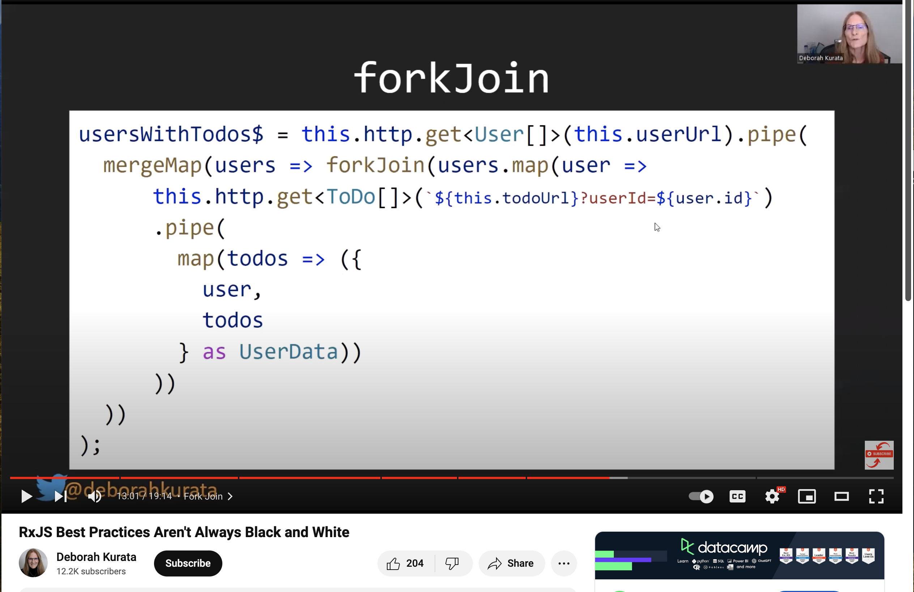

# RxjsDemo

This project was generated with [Angular CLI](https://github.com/angular/angular-cli) version 17.3.7.

# Important link and resources

`https://medium.com/@mlkpatel0/rxjs-operators-in-angular-fd199de5143e#:~:text=A%20Pipeable%20Operator%20is%20a,data%20emitted%20by%20an%20observable.`

`https://www.techiediaries.com/angular-rxjs-tutorial/`

## rxjs operator

`https://www.tektutorialshub.com/angular/debouncetime-debounce-in-angular/`

## rxjs map,filter,input params

`https://medium.com/@pudalepramod/commonly-used-rxjs-features-with-reactive-forms-3e072b14a9f4`
`https://fireflysemantics.medium.com/debouncing-your-angular-search-field-ce6686cf54b3`
`https://medium.com/@mlkpatel0/rxjs-operators-in-angular-fd199de5143e#:~:text=A%20Pipeable%20Operator%20is%20a,data%20emitted%20by%20an%20observable.`

# return a custom type using rxjs pipe

```ts
products() {
    return this.http.get(this.apiUrl).pipe(
      map((res) => res as Product[]),
      tap((res) => console.log('capture products')),
      map((products) => {
        return products.map((product) => {
          return {
            rating: product.rating.rate,
            catrgory: product.category,
          } as CustomizeResponse;
        });
      })
    );
  }
```

## Best Resource for rxjs in youtube

`https://www.youtube.com/watch?v=vtCDRiG__D4`



## I only ever use _these_ RxJS operators to code reactively RxJS

`https://www.youtube.com/watch?v=Byttv3YpjQk`
